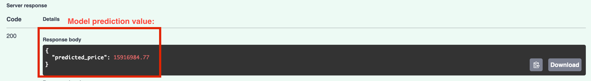

# Laptop Price Predictor

A production-style machine learning system that predicts the **resale price of a used laptop** based on technical specifications. This project is designed to demonstrate real-world ML practices from data cleaning and model training to deployment using FastAPI.


## Project Overview

This project includes:

- ✅ End-to-end data preprocessing and feature engineering
- ✅ Tree-based regression modeling with LightGBM
- ✅ Hyperparameter tuning using Optuna
- ✅ Feature importance analysis
- ✅ Prediction-serving via a REST API using FastAPI

## Project Structure
```
laptop_price_predictor/
├── laptop_price_app.py (FastAPI app)
├── laptop_price_predictor.ipynb (Jupyter notebook for model training)
├── laptop_sample_data.json (sample data and expected output for API testing)
├── laptop_predictor_files/
    └── model/
        └── laptop_price_model.pkl (final model file)
        └── (other model training files)
    └── utils/
        └── preprocessing.py (feature extraction functions)
├── README.md
├── requirements.txt
└── .gitignore
```


## Tech Stack

* **Python 3.12**
* **Pandas / NumPy** — Data handling
* **LightGBM** — Regression model
* **Optuna** — Hyperparameter optimization
* **FastAPI** — Model serving API
* **Regex + Custom logic** — Feature extraction from messy laptop specs


## Example API Usage

**POST** `/predict`

**Request:**
```json
{
  "Manufacturer": "HP",
  "ModelName": "Elitebook 850",
  "Category": "Ultrabook",
  "ScreenSize": 14.0, # diagonal inches
  "ScreenSpec": "IPS Panel Touchscreen 2560x1440",
  "CPU": "Intel Celeron Dual Core N3350 1.1GHz",
  "RAM": 8, # GB
  "Storage": "256GB SSD +  1TB HDD",
  "GPU": "Intel HD Graphics 515",
  "OperatingSystem": "Windows",
  "OperatingSystemVersion": "10",
  "Weight": 2.32 # kilograms
}
```
**Output**
```
{
  "predicted_price": 10715724.76 # Indian Rupees INR
}
```

## Datasets
* Data sourced from https://www.kaggle.com/datasets/arnabchaki/laptop-price-prediction
* Data accessed June 9, 2025
* Price currency is Indian Rupee (INR)

## Import and Setup 

In terminal, execute:

**Clone the Repo**
* `git clone https://github.com/jtolsma1/portfolio/laptop_price_predictor`
* `cd laptop_price_predictor`

**Set Up Environment**
* `conda create -n laptop_env python=3.12`
* `conda activate laptop_env`
* `pip install -r requirements.txt`

**Run the API**
* `uvicorn main:app --reload`
* Then open your browser to http://127.0.0.1:8000/docs to access the API


* Click **"Try It Out"** to request model predictions through the API  


* Copy and paste new (unseen to the model) laptop specifications in **laptop_sample_data.json** to test model predictions through the API  

## Key Highlights

* Built for realistic user input: handles realistic CPU, storage, and screen specs
* Uses regex-based parsing and frequency encoding for generalization
* Fully production-ready architecture with clean modular code
* Intended as a portfolio project to demonstrate full-stack ML capabilities

## ⚠️ Disclaimer: API Scope
This project demonstrates end-to-end machine learning: data prep, model training, tuning, and serving predictions via FastAPI.

The API is not production-hardened. It includes basic input validation but lacks full error handling, authentication, and monitoring. The goal is to showcase the ML pipeline — not to build a fully robust production service.

**Please use the sample data in `laptop_sample_data.json` as a guide for generating valid model inputs through the API.**


## License

This project is open source and available under the MIT License.